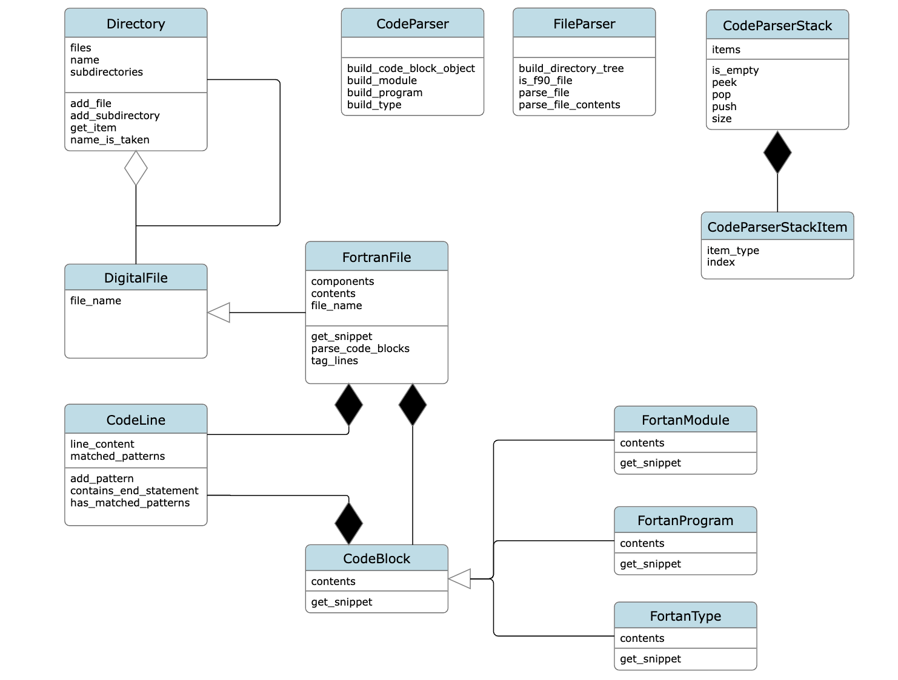
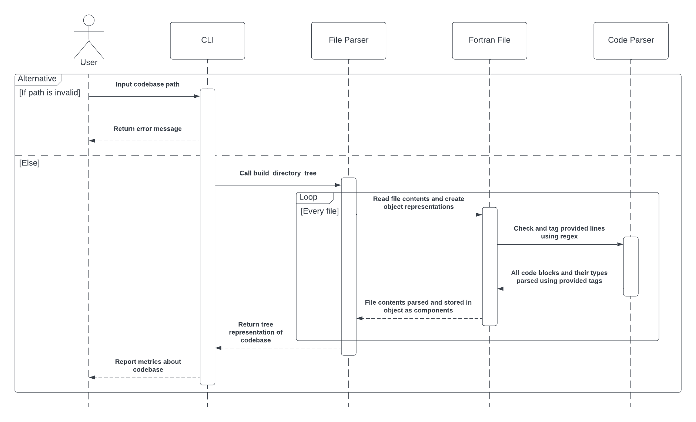

# A Python-based Code Analyser for Fortran 90

This project aims to use the language Python to develop a code analysis tool for the programming
language [Fortran 90](https://en.wikipedia.org/wiki/Fortran).

This project is being undertaken as part of the final year of my Computer Science degree, under the
supervision of [Professor Austen Rainer](https://pure.qub.ac.uk/en/persons/austen-rainer). The end
goal of the project is to be able to parse Fortran 90 files or entire codebases and report back
metrics to the user about their code.

## Installation

Currently, the project installation is simply
[cloning the repository](https://docs.github.com/en/repositories/creating-and-managing-repositories/cloning-a-repository)
and installing any required dependencies, as well as the correct version of Python. This project is
built on version `3.11.2` of Python.

### Requirements

Any dependencies needed for the project are listed in the `requirements.txt` and
`requirements-dev.txt` files, which themselves are compiled using their respective `.in` files and
the library `pip-tools`. It is recommended to
[create a virtual environment](https://docs.python.org/3/library/venv.html#creating-virtual-environments)
for the project before installing any dependencies.

Use the following command in your terminal to install these dependencies: 

```
pip3 install -r requirements.txt -r requirements-dev.txt
```

Alternatively, install `pip-tools` directly and use the included `pip-sync` command to
install/upgrade/uninstall everything necessary to match the requirements:

```
pip3 install pip-tools
pip-sync requirements.txt requirements-dev.txt
```

## Usage

The project is currently CLI-based, the source code for which is available in the `fortran_cli.py`
file. In order to use it, run the file as a regular Python file, supplying whatever
commands/subcommands and arguments needed.

This is what it looks like from the root of the project:

```
python3 src/python/fortran_cli.py <commands/arguments>
```

To show an example, we will use the first command ever added to the analyser, `print-to-console`.
This command takes the path to a Fortran 90 file and simply outputs its raw contents.

So following the above format, an example run of this command looks like:

```
python3 src/python/fortran_cli.py print-to-console --file-path /Users/testuser/fortran/hello_world.f90
```

For a simple hello world program, the output to the terminal would look like the following:

```
PROGRAM hello_world
    PRINT *, "Hello World!"
END PROGRAM hello_world
```

Success! We ran a command using the CLI. 

For a list of all the commands available in the application, see the `fortran_cli.py` file; there is
a docstring at the top of the file that lists all the commands available and what they do. This file
uses the library [Click](https://click.palletsprojects.com/en/8.1.x/#) to build its CLI capability.

## Roadmap

As it currently stands, there is a "release" branch with a snapshot of the state of the code
available on the repository (`release/12-12-23`). This release contains the logic for parsing
through files and picking out the code blocks that make up the file, with support for Fortran
modules, programs, and types.

There are two diagrams pictured below. The first is a class diagram showing the state of the code in
the aforementioned release branch, while the second is a sequence diagram that shows the process of
parsing a Fortran codebase:





Currently, the parsing does not go any deeper than code blocks, and is only available for the 3
types of code blocks mentioned earlier. The aim of the next "release" is to have most types of code
blocks supported and be able to parse deeper into these blocks (such as variables, function calls,
etc). This logic can then be added into the `fortran_cli.py` file in the form of a few commands that
the user can call.

For the final version of the project, I hope to have a working analyser that can read through a
given Fortran 90 codebase and report back metrics about the code that are then stored to some form
of persistent storage, available for use through the project's CLI. I am also aiming to incorporate
features such as a GUI and variable relationships if time permits.

As the project progresses, this section will update with what is available in the project and what
features I am planning to add in the near future.

## Contributing

While there are potential plans to make this tool available after finishing the project, currently
the project's code is not available to others for editing yet. Any and all additions or changes in
the project are made exclusively by myself.

## Support

Find any problems with the application?
[Create an issue in the project's GitLab repo](https://gitlab.eeecs.qub.ac.uk/40291992/fortran-90-analyser/-/issues/new).
Please be mindful to follow the template provided in the issue description.

## Acknowledgements

This project would not be possible without the help of
[Professor Austen Rainer](https://pure.qub.ac.uk/en/persons/austen-rainer). His guidance and support
have been and continue to be instrumental in the development of this code analyser.

I would also like to extend a thanks to the entirety of the InsightCloudSec team in Rapid7. The 15
months I spent on placement as an engineer in their Coverage and Analysis team taught me many things
about not just Python, but the wider world of software development. The experience has undoubtedly
made a huge difference to my final year!

***

**Project Owner:** *[Matthew McAteer](https://github.com/matthew-mca)*

**Last Updated:** *16/01/2024*